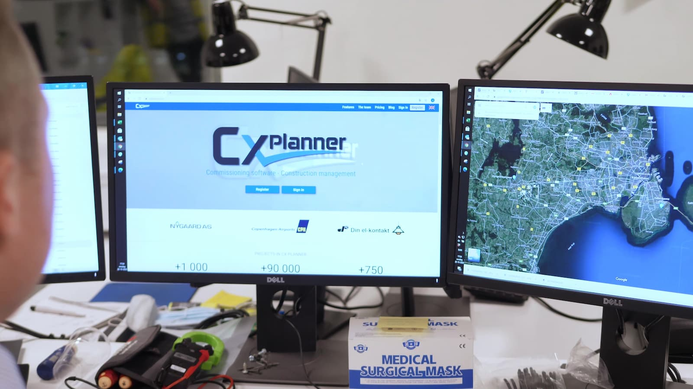

# CxPlanner

*CxPlanner - you project management tool with specialized utilities for commissioning, QA and construction*

____

# What is CxPlanner

CxPlanner was started by [Thomas T. Jarløv](https://ttj.dk) because he needed a software solution to manage multiple projects at the same time. And now it is an international software solution used by many clients to manage and monitor their projects

Since the creation of CxPlanner, the scope and goal has developed - CxPlanner wants to digitalize and optimize the construction industry. While doing this we have developed multiple libraries and tools, which during user testing has shown benefit across many industries.

CxPlanner's core is a project and task management system with all needed tools such as user management and more, but we do also have multiple special plugins.
As one of the only software solutions we are in 100% compliance with ASHRAE Guideline 0 and ASHRAE Standard 202 as well as the Danish Standard DS3090. Besides that we do comply with all documentation requirements within the industry.

The first practical book for the commissioning process (a quality orientated process for construction process) actually includes many screenshots and examples from CxPlanner. See more at [A Practical Guide to the Commissioning Process](https://cxguideline.com) and [Guide til commissioning i praksis](https://cxguide.dk).

# Code base

The main code is closed source and developed internally in CxPlanner. But we do support open source, and we have developed many open source projects and libraries, which we also use in CxPlanner. In that way we ensure updates and stability for these.

Most of our open source projects are currently located at [ThomasTJdev](https://github.com/ThomasTJdev), but will be moved to our organizational repo in the future.

We are all happy [Nim-lang](https://nim-lang.org/) coders, and we would like to encourage any new or experienced programmer to take Nim for run. Fast, Efficient, Python like syntax, Elegant, C-speed, and much more.

# Locations

Our main location is Denmark, but our software is available at Danish, English, Spanish and Dutch. We do have supporters and sellers in those locations, so just send us an email at support@cxplanner.com for more information.

# Website

Visit us at [CxPlanner.com](https://cxplanner.com) to try our software or see more.

